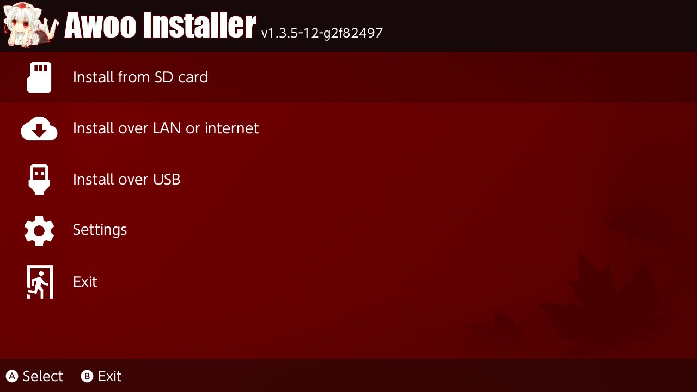

# Awoo Installer
A No-Bullshit NSP, NSZ, XCI, and XCZ Installer for Nintendo Switch

## Features
- Installs NSP/NSZ/XCI/XCZ files and split NSP/XCI files from SD card
- Installs NSP/NSZ/XCI/XCZ files and split NSP/XCI files over USB from HDD
- Installs NSP/NSZ/XCI/XCZ files over LAN or USB from tools such as [NS-USBloader](https://github.com/developersu/ns-usbloader)
- Installs NSP/NSZ/XCI/XCZ files over the internet by URL or Google Drive
- Verifies NCAs by header signature before they're installed
- Based on [Adubbz Tinfoil](https://github.com/Adubbz/Tinfoil)
- Uses [XorTroll's Plutonium](https://github.com/XorTroll/Plutonium) for a pretty graphical interface
- Just werks

## Thanks to
- HookedBehemoth for A LOT of contributions
- Adubbz and other contributors for [Tinfoil](https://github.com/Adubbz/Tinfoil)
- XorTroll for [Plutonium](https://github.com/XorTroll/Plutonium) and [Goldleaf](https://github.com/XorTroll/Goldleaf)
- blawar (wife strangulator) and nicoboss for [NSZ](https://github.com/nicoboss/nsz) support
- The kind folks at the AtlasNX Discuck (or at least some of them)
- The also kind folks at the RetroNX Discuck (of no direct involvement)
- [namako8982](https://www.pixiv.net/member.php?id=14235616) for the Momiji art
- TheXzoron for being a baka
